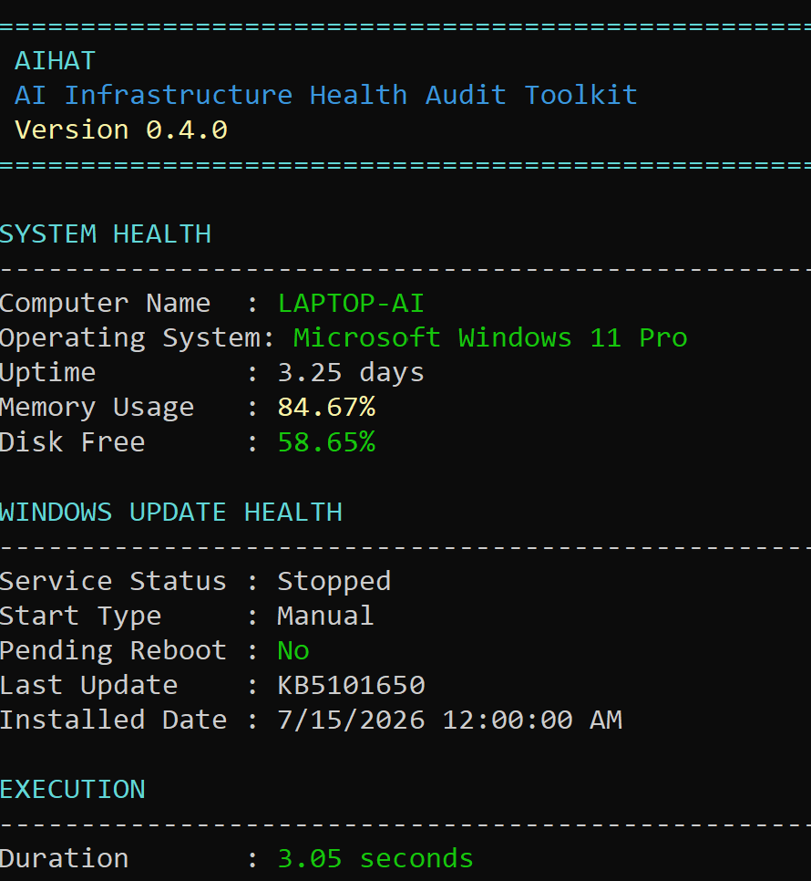
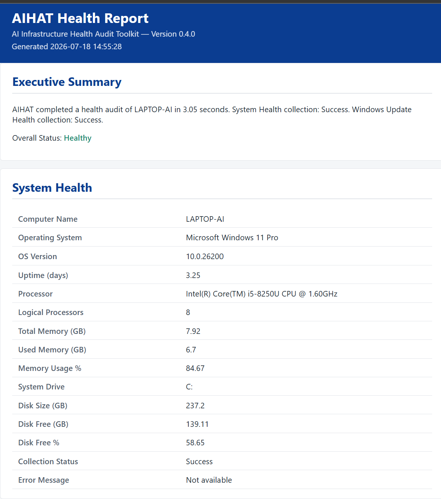

# AIHAT

**Audit Windows system health and get a shareable report — in under five minutes.**


AIHAT is an open-source PowerShell toolkit for Windows System Administrators. Instead of collecting system health information by hand, `Invoke-AIHAT` gathers it, aggregates it into one result object, and gives you both a live console dashboard and a self-contained HTML report — from a single command.

---

## Screenshots

### Console Dashboard



Running `Invoke-AIHAT` prints a color-coded summary straight to your terminal: System Health, Windows Update Health, and execution details (duration, log file path), all in one screen — no scrolling through raw command output required.

### HTML Health Report



Every run also produces a self-contained HTML report — an executive summary, overall status, and the full System Health and Windows Update Health data in a clean, shareable format. Useful for tickets, audits, or handing results to someone who doesn't have a terminal open.

---

## Why AIHAT?

Windows environments naturally accumulate operational drift over time:

- Missing updates
- Configuration inconsistencies
- Health issues
- Incomplete documentation

AIHAT provides a repeatable way to collect infrastructure health data and generate consistent reports for troubleshooting, auditing, and ongoing maintenance.

---

## Features

✔ System Health
✔ Windows Update Health
✔ HTML Reporting
✔ Modular Architecture
✔ Logging Engine
✔ Console Dashboard
✔ Pester Tested
✔ PSScriptAnalyzer Clean
✔ MIT Licensed

---

## Quick Start

```powershell
git clone https://github.com/Beyond-Automation/AIHAT.git
cd AIHAT
. .\src\Invoke-AIHAT.ps1
Invoke-AIHAT -PassThru
```

Requires Windows and PowerShell 7+. Administrator privileges are recommended — some health checks read protected registry keys and services.

---

## Architecture

```text
Invoke-AIHAT.ps1
        │
────────┼────────
        Core
  Configuration
  Logging
  Dashboard
  Reporting
────────┼────────
      Modules
  System Health
  Windows Update
```

`Invoke-AIHAT` loads configuration, runs each health module independently, aggregates the results into one object, then hands that object to the console dashboard and the HTML reporting engine. Modules don't know about each other — adding a new health check means adding a new module, not touching the orchestrator. Full design details live in [ARCHITECTURE.md](ARCHITECTURE.md).

---

## Example Output

```powershell
$result = Invoke-AIHAT -PassThru

$result.ReportFilePath
# C:\AIHAT\Reports\AIHAT_2026-07-18_134441.html
```

`-PassThru` returns the full result object, including `ReportFilePath` — the path to the report shown in the [Screenshots](#screenshots) above. If report generation fails, the run still completes and `ReportFilePath` is `$null`.

---

## Documentation

| Document | Purpose |
|---|---|
| [ARCHITECTURE.md](ARCHITECTURE.md) | System design, execution flow, and project structure |
| [ROADMAP.md](ROADMAP.md) | Version history and planned work |
| [PROJECT.md](PROJECT.md) | Project background and current status |
| [SECURITY.md](SECURITY.md) | Vulnerability reporting policy |
| [CONTRIBUTING.md](CONTRIBUTING.md) | How to contribute |

---

## Roadmap

**Completed**
- [x] Configuration Engine & Invoke-AIHAT
- [x] Logging Engine
- [x] System Health
- [x] Windows Update Health
- [x] Console Dashboard
- [x] HTML Reporting

**Current**
- [ ] v0.4.0 release preparation

**Planned**
- [ ] Microsoft Defender Health
- [ ] BitLocker Health
- [ ] Network Health
- [ ] Service Health
- [ ] Event Log Health
- [ ] Health Score
- [ ] JSON / CSV Export

Full version-by-version breakdown: [ROADMAP.md](ROADMAP.md)

---

## Engineering Principles

- Modular PowerShell architecture
- Automated testing with Pester
- Static analysis with PSScriptAnalyzer
- Clear, versioned documentation
- Git-based development workflow
- AI-assisted development with human review

---

## Known Limitations

`Show-AIHATDashboard` calls `Clear-Host`, which sets the console cursor position. In non-interactive or redirected PowerShell hosts (some CI runners or automation hosts without a real console handle), this can raise a non-terminating `SetValueInvocationException` ("The handle is invalid."). The dashboard output still renders correctly afterward — this is a display-only limitation and does not affect audit results.

---

## Contributing

Contributions are welcome. Read [CONTRIBUTING.md](CONTRIBUTING.md) and the [Code of Conduct](CODE_OF_CONDUCT.md) first. Before opening a PR, run:

```powershell
Invoke-ScriptAnalyzer -Path ./src -Recurse -Settings ./PSScriptAnalyzerSettings.psd1 -Severity Error,Warning
Invoke-Pester -Path ./tests
```

---

## License

MIT — see [LICENSE](LICENSE).

Built by **Beyond Automation** — Engineering Smarter IT Operations.
